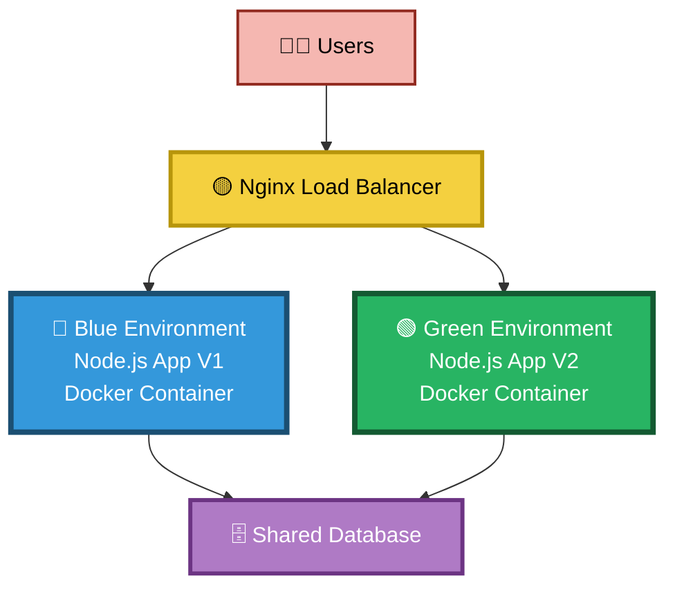
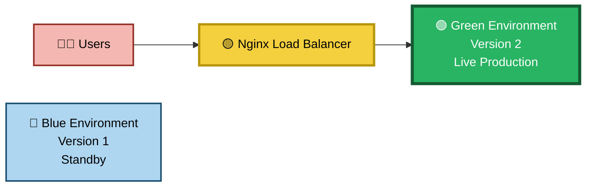

# Blue-Green Deployment & Zero Downtime Release Strategy

## Project Overview

This project demonstrates a production-style **Blue-Green Deployment Strategy** using **Docker**, **Nginx Load Balancer**, and **Node.js** applications. The objective is to achieve **zero downtime deployments**, seamless traffic switching, and instant rollback capabilities.

Blue-Green Deployment is widely used in modern DevOps environments to release new application versions without affecting end users.

---

## Architecture Diagram

### Before Deployment

# Blue-Green Deployment & Zero Downtime

## Architecture Diagram



### After Deployment



---

## Project Architecture

```text
                   Users
                     │
                     ▼
            ┌─────────────────┐
            │  Nginx LB       │
            │   Port 80       │
            └────────┬────────┘
                     │
        ┌────────────┴────────────┐
        │                         │
        ▼                         ▼

   Blue Environment         Green Environment
   Version 1                Version 2
   Port 3001                Port 3002

        Docker                  Docker
```

---

## Technology Stack

* Docker
* Docker Compose
* Nginx Load Balancer
* Node.js
* Express.js
* AWS EC2 (Ubuntu)
* Git & GitHub

---

## Project Structure

```text
Blue-Green-Deployment-Project/

├── app-blue/
│   ├── app.js
│   ├── package.json
│   └── Dockerfile
│
├── app-green/
│   ├── app.js
│   ├── package.json
│   └── Dockerfile
│
├── nginx/
│   └── nginx.conf
│
├── screenshots/
│   ├── before-deployment.png
│   └── after-deployment.png
│
├── docker-compose.yml
│
└── README.md
```

---

## Features

* Blue-Green Deployment Strategy
* Zero Downtime Releases
* Traffic Switching using Nginx
* Instant Rollback Capability
* High Availability Architecture
* Containerized Applications
* Production-Ready Deployment Workflow

---

## Blue Environment (Version 1)

The Blue environment serves the current production version of the application.

**Port:** 3001

```bash
http://<EC2-PUBLIC-IP>:3001
```

---

## Green Environment (Version 2)

The Green environment hosts the new application version before traffic is switched.

**Port:** 3002

```bash
http://<EC2-PUBLIC-IP>:3002
```

---

## Load Balancer

Nginx acts as the entry point for all user traffic.

**Port:** 80

```bash
http://<EC2-PUBLIC-IP>
```

Traffic can be routed to either:

* Blue Environment
* Green Environment

without affecting users.

---

## Deployment Workflow

### Step 1: Deploy Blue Environment

```bash
docker compose up -d
```

Verify:

```bash
docker ps
```

---

### Step 2: Verify Blue Application

Open:

```bash
http://<EC2-PUBLIC-IP>
```

Expected Output:

```text
BLUE ENVIRONMENT - VERSION 1
```

---

### Step 3: Deploy Green Environment

Build and run Version 2 alongside Version 1.

```bash
docker compose up -d --build
```

Green environment becomes available on:

```bash
http://<EC2-PUBLIC-IP>:3002
```

---

### Step 4: Switch Traffic

Update Nginx configuration:

```nginx
upstream backend {
    server green:3000;
}
```

Reload Nginx:

```bash
docker exec nginx-lb nginx -s reload
```

---

### Step 5: Verify Zero Downtime

Users continue accessing:

```bash
http://<EC2-PUBLIC-IP>
```

Traffic is now served by:

```text
GREEN ENVIRONMENT - VERSION 2
```

without service interruption.

---

## Rollback Strategy

If Version 2 fails:

Update Nginx:

```nginx
upstream backend {
    server blue:3000;
}
```

Reload:

```bash
docker exec nginx-lb nginx -s reload
```

Traffic immediately returns to Version 1.

---

## Failure Simulation

This project demonstrates rollback by:

1. Introducing an error in Green Version
2. Deploying the faulty version
3. Detecting failure
4. Redirecting traffic back to Blue

Result:

```text
No user downtime
Instant recovery
```

---

## Verification Commands

### Running Containers

```bash
docker ps
```

### Container Logs

```bash
docker logs blue-app

docker logs green-app

docker logs nginx-lb
```

### Nginx Reload

```bash
docker exec nginx-lb nginx -s reload
```

---

## Screenshots

### Running Containers

Add Screenshot Here

### Blue Environment

Add Screenshot Here

### Green Environment

Add Screenshot Here

### Nginx Load Balancer

Add Screenshot Here

### Traffic Switching

Add Screenshot Here

### Rollback Demonstration

Add Screenshot Here

---

## Learning Outcomes

This project provides hands-on experience with:

* Blue-Green Deployment
* Zero Downtime Releases
* Nginx Load Balancing
* Docker Containerization
* Rollback Strategies
* Release Management
* High Availability Systems
* Production DevOps Practices

---

## Future Enhancements

* Jenkins CI/CD Pipeline
* GitHub Actions Automation
* Kubernetes Deployment
* AWS Application Load Balancer
* Health Checks & Monitoring
* Canary Deployment Strategy

---

## Resume Description

Implemented a production-grade Blue-Green Deployment architecture using Docker and Nginx Load Balancer. Deployed parallel application environments, achieved zero downtime releases through controlled traffic switching, simulated deployment failures, and demonstrated instant rollback strategies. Improved deployment reliability, application availability, and release management practices following real-world DevOps standards.

---

## Author

**Jeny**

DevOps Engineer | Cloud & Automation Enthusiast

GitHub: https://github.com/your-username
